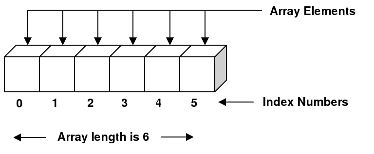

# Arrays Lesson

JavaScript arrays are used to store multiple values in a single variable.

## Learning Objectives

- Understand how to create an array, and why you'd want to.
- Know basic array property `length`.

---

# Array Introduction

An array provides a convenient way to store a collection of **things / data**. Say we want to keep the numbers `2`, `3`, `5`, `7`, and `11` - all in one place.
Instead of creating five separate variables we can create an array to store all these values.
To create an array, we use the `[` and `]` square brackets, and in between put whatever values we need separated by commas.

We can also call new on the Array class and pass in the elements desired, but this is less common and not the preferred way. Use the brackets when you can.

```js
let arr = [2, 3, 5, 7, 11];

// OR

let arr = new Array(2, 3, 5, 7, 11);
```

Arrays (like strings) like strings can be accessed with indexes and have a `length` property.

Each element in an array has its own index number which represents the elements location in the array - these start at 0 and increase by 1 for every subsequent element. We can access each single element in an array by using square brackets in which we write that elements's index number.



We can put any type of variables or data as elements of an array. We can even mix different types in a single array or put an array itself as one
of the elements.

```js
let animals = ["cat", "dog", "raccoon"];
let mixedArray = [2, 5, "zebra", ["Can", "you", "believe", "it"]];
```

However it is **BEST** practice to use the same data type across all elements in the array.

We access the first element of the array by using index `0`, and the last by using index `array.length - 1`

```js
let animals = ["cat", "dog", "raccoon", "giraffe"];

// this will print 'cat'
console.log(animals[0]);

// this will print 'giraffe'
console.log(animals[animals.length - 1]);
```

### Resources

- [w3schools - Arrays](https://www.w3schools.com/jsref/jsref_obj_array.asp)
