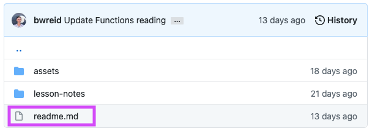

# Markdown

## Setup

Please complete the following before the lesson begins:

- Open and this [Markdown file](./warmup.md).
- Complete the Warmup Questions & Tasks detailed at the top of the file.

## Learning Objectives

By the end of this lesson you should be able to:

- Create and edit files using the Markdown syntax.
- Include lists, links, images in your Markdown file.
- Include formatted code in your Markdown file.

---

## Guiding Questions

- In your own words, describe what Markdown is.

- What are some of the benefits to using Markdown as opposed to other text formats?

- What file extension is used to denote a file uses Markdown?

- Create a new Markdown file on your computer and open it with VSCode.

  Then, open up the command pallette with `Cmd` + `Shift` + `P`. Type "markdown" until you see the option "Open Preview to the Side". Select that option and then type some text in your `.md` file.

  What happens as you type?

- What is a heading? Include at least one in your Markdown file.

- How do you create different paragraphs with Markdown? Include two different paragraphs in your Markdown file.

- How do you bold text in Markdown? Try bolding some text in your Markdown file.

- How do you italicize text in Markdown? Try italicizing some text in your Markdown file.

- How do you create a list with bullet points in Markdown? Identify at least one way to do so and then add it to your Markdown file.

- How do you create a list that uses numbers in Markdown? Identify at least one way to do so and then add it to your Markdown file.

- There are multiple ways to add links to Markdown. Identify at least one way and add it to your Markdown file.

- There are multiple ways to add images to Markdown. Identify at least one way and add it to your Markdown file.

- What is "alternate text" in regards to images on the web?

- How do you highlight a single word with code syntax, `like this`, in Markdown? Apply this to one or two words in your file.

- How do you create a code block, like the example below, in Markdown?

  ```
  "Hello, World!"
  ```

  Add a codeblock to your Markdown file.

- How do you create a code block that has syntax highlighting for the appropriate language, like the example below?

  ```js
  function convertTextToH1(text) {
    return `# ${text}`;
  }
  ```

  Update your codeblock so that it uses JavaScript syntax highlighting.

## Exercise

All of the lesson notes you have been viewing have been written in Markdown!

At the top of this page, you might see a link to a file called `readme.md`. Go ahead and click that link.



Next, locate where it says "Raw". If you can't find it, try clicking the three dots at the top of the file and then select "View raw".


Once you've done so, you should see what looks to be Markdown!

Finally, answer the following questions before checking in with an instructor.

1. What level of heading is the "Exercise" text? (e.g. H1, H2, H3...)

1. How is the Warmup for this lesson linked in this file?

1. Take a look at the codeblock that is formatted in the JavaScript syntax. Instead of writing `javascript` next to the three back ticks, what is there?

1. Do the images in this file have alternate text? How do you know?
