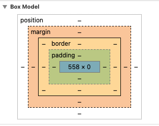
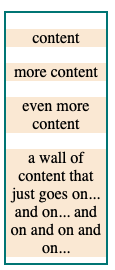
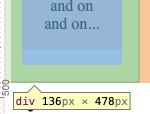

# CSS Box Model

## Learning Objectives

By the end of this lesson you should be able to:

- Describe the properties of the CSS box model
- Define padding, margin, and borders for customizing an HTML element
- Compare and contrast default display properties
- Explore positioning

---

## HTML Elements are a Box

### Every HTML element has default box properties made up of:

- content (inner width and height)
- padding
- border
- margin
- display
- position

In your browser `dev` tools you can see the box model of any element by hovering over it.

The below element has:

- `content` with a `width` of of 500px and `height` of 250px
- `padding` with `top` and `bottom` of 50px, and `left` `right` of 10px
- `border` with 2px on each side
- `margin` `top` and `bottom` of 25px
- `position` `-` which is the default (static)


The order of content as the most inside component to margin (outside component) always stays the same.

### Content

Content generally means text and other html elements, (the rules for images are a little different - we'll cover it later).

- content will adjust to the maximum width allowed by its container (parent html element) or viewport (browser size)
- once it has reached maximum width, content will expand in terms of height

Let's look at an example:

**index.html**

Let's start with an empty `div`. A `div` has a default `display` of `block` - which means it can be the only element going across and it takes up the entire width of the viewport (browser).

It has a height of 0, because it currently has no content

**index.html**

```html
<div></div>
```

**appearance**



By default a div has

- no content (height of 0)
- width matches the viewport (browser) size
- no padding
- no border
- no margins

Let's add some content:

```html
<div>
  <p>content</p>
  <p>more content</p>
  <p>even more content</p>
  <p>
    a wall of content that just goes on... and on... and on and on and on...
  </p>
</div>
```

Let's limit the width and add a border to the div.

In order to show the `p` tags, let's add a `background-color`

**main.css**

```css
div {
  width: 100px;
  border: 2px solid teal;
}

div p {
  background-color: antiquewhite;
}
```

**appearance**



As we can see, the content (text), stays within the boundary of the container's width. Then it automatically expands downward, increasing the height of itself `p` tags, and the height of the `div`


If we look at the box model for a `p` tag, we'll notice that it has a default `margin-top` and `margin-bottom` of 16px


With practice and usage, you will get used to what to expect for default settings of different elements. You may notice, if you use different browsers, that the defaults might be slightly different.

When determining what element to use, you should choose the [semantic](https://www.w3schools.com/html/html5_semantic_elements.asp) one and then style it correctly. For example, if you need to make a top level `heading`, but you prefer the size and margins of an `h2`, you should use an `h1`, but then style it, with CSS, to make it the size you want.

### Padding

Padding puts space between the content and the border of the element.

**main.css**

```CSS
div p {
    background-color: antiquewhite;
    text-align: center;
    padding: 16px;
}
```

Notice that `padding: 16px` adds padding to all four sides


```css
div {
  width: 100px;
  border: 2px solid teal;
  padding: 16px;
}
```


Now the `p` has padding (more `antiquewhite` area) and the `div` has padding, area between the `p` tag (content) and `border`

**Note:** Now the total `width` of the `div` has increased from 100px to 136.



This is because the base width is set by content. Padding of 16px, on both sides = 32 and then 2px of border on each side = 4.

The width is now 100px + 32 + 4 = 136

If you need to constrain the width to be exactly 100px, regardless of padding and borders, you can use:

```css
box-sizing: border-box;
```

We can also make each side of padding different. The arguments go like a clock they start top (12), then right to (3), then bottom (6) and then left (9)

**Note:** for ease of viewing, he width of the div has been adjusted to 300px

```css
div {
  width: 300px;
  border: 2px solid teal;
  padding: 12px 3px 6px 9px;
  box-sizing: border-box;
  margin: 4px auto;
}
```

### Border

`border` has 3 arguments always in the same order the width of the border, the type of border, and the color

A mnemonic to help remember the order is `1 solid gold` bar

```css
border: 1px solid gold;
```

Then, you can change the properties, as needed

## Margins

One common thing to do with an html element is to center it horizontally.

To do so, we must set the width to be less than 100% of the viewport (browser) or container. Then we must set the left and right margin properties to `auto`

When you use two arguments for `padding` or `margin`, the first represents top/bottom and the second represents left/right

```css
div {
  width: 300px;
  border: 2px solid teal;
  padding: 16px;
  box-sizing: border-box;
  margin: 4px auto;
}
```

You can also set each margin individually:

```css
div p {
  background-color: antiquewhite;
  text-align: center;
  padding: 16px;
  margin-top: 12px;
  margin-right: 3px;
  margin-bottom: 6px;
  margin-left: 9px;
}
```

### Display

There are a few different display properties:

- block
- inline
- inline-block
- none
- flex
- grid

#### Block

This is the default for many elements such as headings, paragraph, div, article, unordered lists

By default these elements are the full width of the viewport or container element. You cannot put another element horizontally next to this element. You would need to change the display property to do that

#### Inline

This is the default for html elements that go inside a text tag, ie a ``tag, height and width properties have no effect on this display type. It keeps the element in line with the parent element.

For example wrapping the word `more` inside a span tag will not affect where it is in the p tag. Typically, one would use the `span` tag to add additional style (change the color)

```html
<p>even <span>more</span> content</p>
```

Another common element with a default display of `inline` is an `img` tag. If you would like to center an image, you would need to set the display to `block` and then set `margin` `auto`

#### Inline-block

This has the same behavior as an `inline` display, however you can set width and height properties. An example of an element with this as a default display property is a `button`

Let's try an example. We can add this code below our div

**index.html**

```HTML
   <ul>
       <li>one</li>
       <li>two</li>
       <li>three</li>
   </ul>
```

**main.css**

```CSS
ul {
    border: 3px solid lightsalmon;
    width: 50%;
    margin: auto;
}

li {
    border: 1px solid mediumslateblue;
    text-align: center;
    padding: 8px;
}

```

Let's remove some default styling from the unordered list and list items.

```CSS
ul {
    border: 3px solid lightsalmon;
    width: 50%;
    margin: auto;
    padding-left: 0;
}
li {
    border: 1px solid mediumslateblue;
    text-align: center;
    padding: 8px;
    list-style: none;
}

```


```CSS
li {
    border: 1px solid mediumslateblue;
    text-align: center;
    list-style: none;
    padding: 8px;
    display: inline-block;
}
```


**Try it!**: change `inline-block` to `inline` - notice how the height property is no longer being utilized

#### None

This property allows you to hide the element. This property is most useful when combined with JavaScript to show or hide an element (e.g. open and close an info box)

```CSS
 li {
     display: none;
 }
```

<hr />

#### BONUS: Flex

Flex is a newer display, introduced in 2009. [Flex](https://css-tricks.com/snippets/css/a-guide-to-flexbox/) sets the `flexbox` property on the container which will impact all the children components. Flexbox is great for:

- Centering elements (an alternative to `margin: auto`)
- [Setting elements equidistantly from each other](https://css-tricks.com/equidistant-objects-with-css/)
- [Vertical centering](https://philipwalton.github.io/solved-by-flexbox/demos/vertical-centering/)
- Creating a [sticky footer](https://philipwalton.github.io/solved-by-flexbox/)

Example of equidistant spacing:

```CSS
ul {
   border: 3px solid lightsalmon;
   width: 50%;
   margin: auto;
   padding-left: 0;
   display: flex;
   justify-content: space-around;
}
```

**Try it** : change the property of `justify-content` to `space-between` or `center`

#### BONUS: Grid

[Grid](https://css-tricks.com/snippets/css/complete-guide-grid/) is the newest display type, it became widely accepted by most browsers in ~ 2017. It allows elements to be laid out in a responsive grid and thus allows creating complex, responsive layouts to be achieved with relative ease, especially in contrast to older techniques

### Position

By default, elements have a property of `static`. HTML elements. Elements are loaded from top to bottom, as each element takes up space, it moves the next element to the right and down.

Sometimes we want to take things out of the flow. And before the arrival of flexbox and grid using these properties to create layouts was much more common. Now there are better ways to do layout, but there are use cases where these position properties can still be useful.

We might want them to be `fixed` in position - no matter where other elements are in the page, nor the size of the viewport, this will keep the element in the exact position in relation to the viewport.

A good example of this would be a nav bar that is always at the top, even if you scroll down the content.

We may want an element that is `absolute` in position, relative to another, non-static element.

A good example of this is a modal (pop-up) that is always center in the page.

Another one is `relative` - where the element is moving from where it _would_ be to the specified offset. This is useful when you are working with other elements that are no longer set to static.

A great way to learn more how these properties behave is to play around with them

[W3 Schools Demo](https://www.w3schools.com/cssref/playit.asp?filename=playcss_position&preval=absolute)

### Z-Index

Sometimes you want to be sure that one HTML element is on top of another one (this is only something you can set when the `position` `static` has been changed to something else, like `absolute`, `fixed`, `relative` etc.)

You can choose how the elements stack by giving them a `z-index` number. Remember the `x-axis` goes across, the `y-axis` up/down and the `z-axis` goes towards/away from you (in a 3D plane)

**index.html`**

```HTML
    <h1>This is an awesome pop up message</h1>
```

```CSS
h1 {
    position: fixed;
    top: 100px;
    left: 100px;
    width: 50%;
    padding: 64px;
    background-color: lightsteelblue;
    color: cornsilk;
    opacity: .9;
}
```


**Try it**: If we would want, we could move this pop up to be behind the other elements

```CSS
h1 {
   position: fixed;
   top: 100px;
   left: 100px;
   width: 50%;
   padding: 64px;
   background-color: lightsteelblue;
   color: cornsilk;
   opacity: .9;
   z-index: -1
}
```

**BONUS** : [Use this guide to center the modal](https://css-tricks.com/considerations-styling-modal/)

---

Full code:

```HTML
    <head>
        <title>Box Model</title>
        <link rel="stylesheet" href="main.css">
    </head>
    <body>
        <div>
            <p>content</p>
            <p>more content</p>
            <p>even <span>more</span>  content</p>
            <p>a wall of <span>content </span>that just goes on... and on... and on and on and on...</p>
        </div>
        <ul>
            <li>one</li>
            <li>two</li>
            <li>three</li>
        </ul>
        <h1>This is an awesome pop up message</h1>
    </body>
</html>
```

```CSS
div {
    width: 300px;
    border: 2px solid teal;
    padding: 12px 3px 6px 9px;
    box-sizing: border-box;
    margin: 4px auto;
}

div p {
    background-color: antiquewhite;
    text-align: center;
    padding: 16px;
    margin-top: 12px;
    margin-right: 3px;
    margin-bottom: 6px;
    margin-left: 9px;
}


ul {
    border: 3px solid lightsalmon;
    width: 50%;
    margin: auto;
    padding-left: 0;
    display: flex;
    justify-content: space-around;
}

li {
    border: 1px solid mediumslateblue;
    text-align: center;
    list-style: none;
    padding: 8px;
    /* display: inline-block; */
}

h1 {
    position: fixed;
    top: 100px;
    left: 100px;
    width: 50%;
    padding: 64px;
    background-color: lightsteelblue;
    color: cornsilk;
    opacity: .9;
    z-index: -1;
}
```
