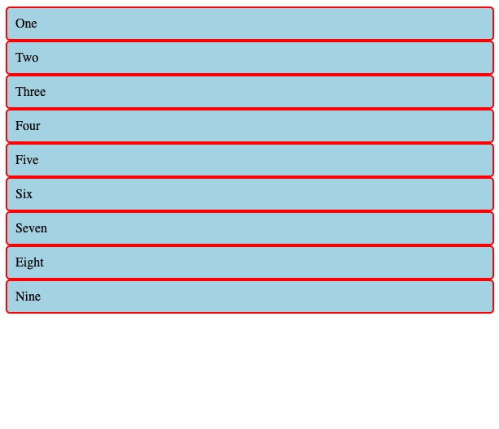
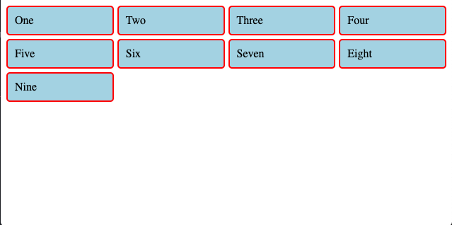
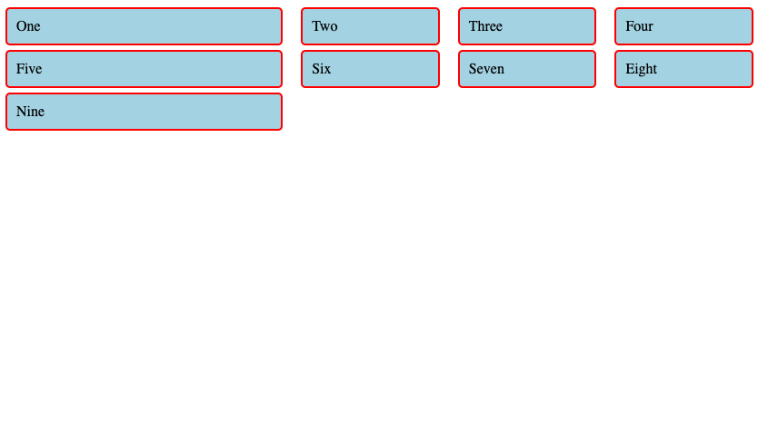
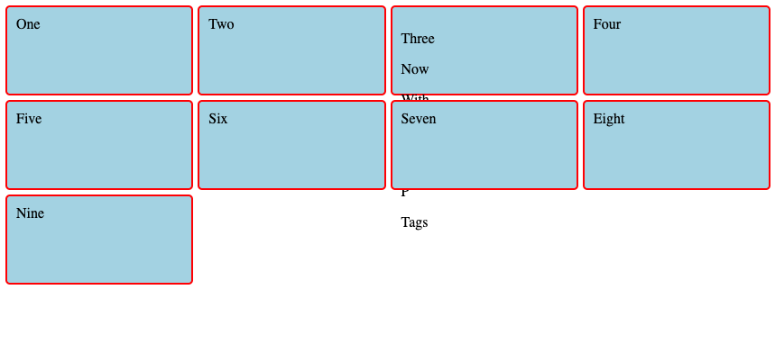
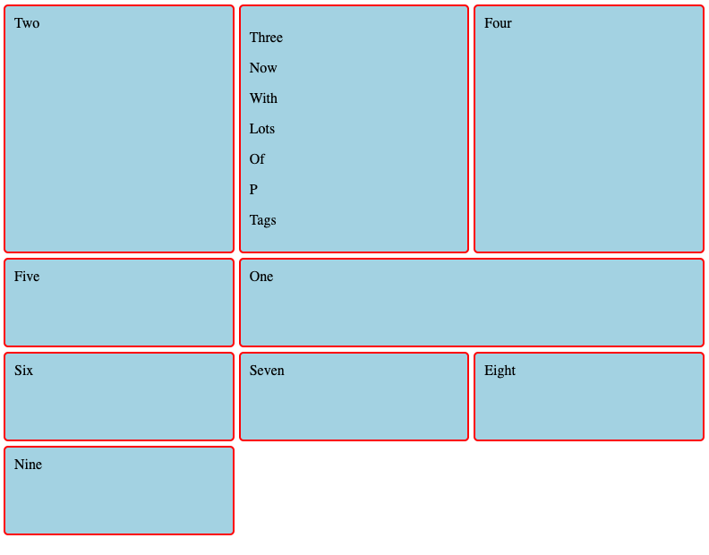
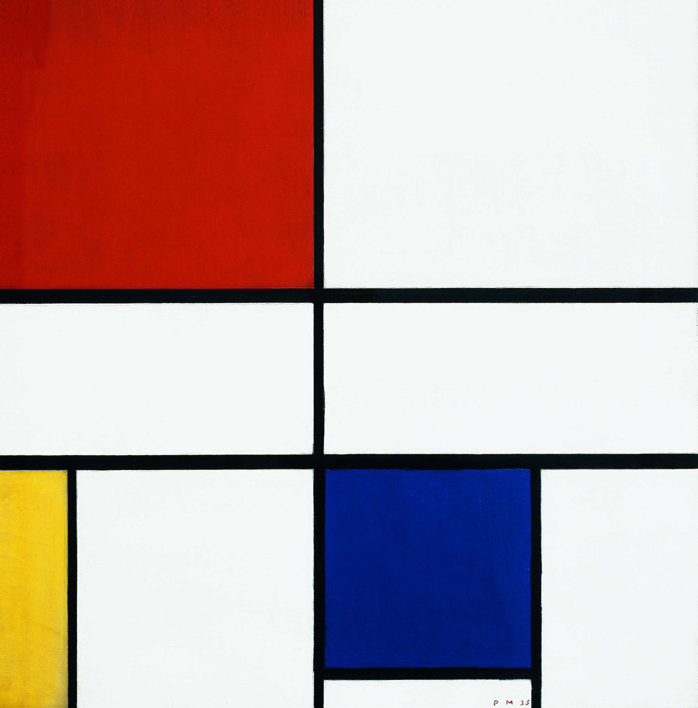
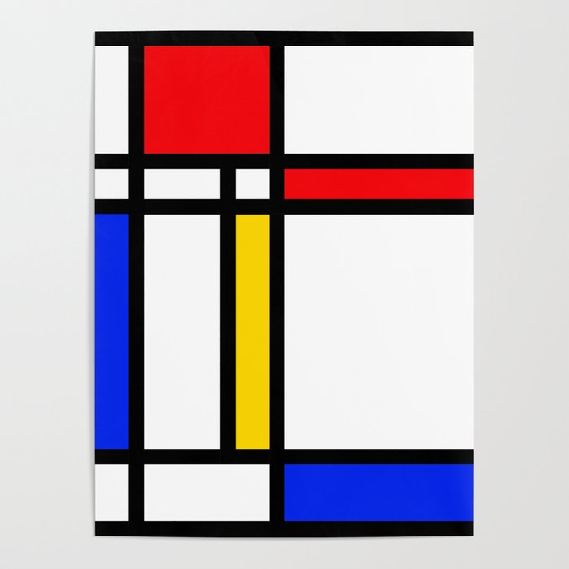
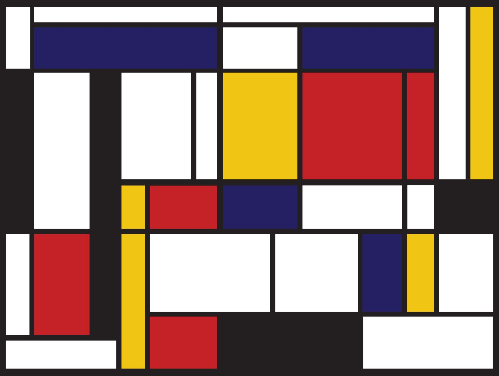

# CSS Grid

CSS Grid is a major improvement to CSS. Laying elements out cleanly was a particularly difficult task in the past, but CSS grid makes them much easier.

In this lesson, you'll learn how to implement the `grid` display value and use it to structure your page. By the end of this lesson, you should be able to build a layout similar to many popular websites.

## Learning Objectives

By the end of this lesson you should be able to:

- Describe the purpose of `grid` display value and what advantages it brings with it.
- Style a simple web page that includes a header, footer, sidebar, and main section using CSS grid.
- Style content inside of grid areas.

---

## What is grid?

CSS Grid Layout is a two-dimensional layout system for the web. It lets you lay content out in rows and columns, and has many features that make building complex layouts straightforward.

The basic idea behind grid is this:

- Specify how many rows and/or columns you want.
- Specify how big those rows and columns should be.
- Grid does the work of laying them out for you!

<details>
<summary>Starter Code</summary>

If you'd like to follow along while reading this lesson, create two new files: `grid.html` and `grid.css` in a folder of your choice.

Copy the following code into your HTML:

```html
<!DOCTYPE html>
<html lang="en" dir="ltr">
  <head>
    <meta charset="utf-8" />
    <title>GRID!</title>
    <meta name="viewport" content="width=device-width, initial-scale=1" />
    <link rel="stylesheet" href="./grid.css" />
  </head>
  <body>
    <div class="container">
      <div class="child one">One</div>
      <div class="child two">Two</div>
      <div class="child three">Three</div>
      <div class="child four">Four</div>
      <div class="child five">Five</div>
      <div class="child six">Six</div>
      <div class="child seven">Seven</div>
      <div class="child eight">Eight</div>
      <div class="child nine">Nine</div>
    </div>
  </body>
</html>
```

Add this styling to your CSS file:

```css
.child {
  border-radius: 5px;
  padding: 10px;
  background-color: lightblue;
  border: 2px solid red;
}
```



Now, let's see how we can use grid to style our page further.

</details>

## Columns

To define a grid we use the grid value of the `display` property. Inside your CSS add the code:

```css
.container {
  display: grid;
}
```

When we open our new page it will look exactly the same as before. Declaring `display: grid;` gives you a one column grid, so your items will continue to display one below the other as they do in normal flow.

To see something that looks more like a grid we can add some columns. Add the `grid-template-columns` property to your container:

```css
.container {
  display: grid;
  grid-template-columns: 200px 400px;
}
```


Using the `grid-template-columns` property, we specified that we needed exactly 2 columns, both with a width of 200 pixels.
We can add additional columns by adding more values to the property.

```css
.container {
  display: grid;
  grid-template-columns: 200px 200px 55px 380px;
}
```

Let's talk about what happens here. We have 1 parent (`.container`) and 9 children elements (`.child`).


We set `display: grid;` on the parent, and specify 4 columns of various sizes.

Because we have 4 columns, the first row has the children `one`, `two`, `three`, and `four`.

The next row contains the next four children: `five`, `six`, `seven`, and `eight`.

The last row only contains `nine` because there are no more children to fill in the columns with.

When we set `display: grid;` on any element, it only affects the _immediate children._

## Fractional grids

We can also use different units instead of pixels. `fr` stands for "fraction" and allows us to set the relative size of each column.

The CSS below will make 3 columns, where the first one is twice as big as the other two:

```css
.container {
  display: grid;
  grid-template-columns: 2fr 1fr 1fr;
}
```


Note that as you adjust the size of the window, the columns stretch or shrink to fill up the window.

How would you make a grid with 4 columns of equal size?

<details>
<summary>Solution</summary>

```css
.container {
  display: grid;
  grid-template-columns: 1fr 1fr 1fr 1fr;
}
```

</details>

It's a little repetitive to have to repeat `1fr` ourselves. If we had 10+ columns, that'd be a lot of repetition. Fortunately, grid has a `repeat` keyword that allows us to duplicate an element:

```css
.container {
  display: grid;
  grid-template-columns: repeat(4, 1fr);
}
```

We can also combine `fr` and `px`. The css below will have one column take up 200 pixels, and split the remaining space evenly among two additional columns:

```css
.container {
  display: grid;
  grid-template-columns: 200px 1fr 1fr;
}
```

## Rows

Just like you do with `grid-template-columns`, you can specify `grid-template-rows` to define how many rows you want your grid to have.

For each of these, the size of the columns does not matter.

- Add more children so that you have a total of twenty (20)!
- Build a grid that has 5 rows and 4 columns.
  - these 5 rows should be all equally sized
- Build a grid that has 4 rows and 5 columns.
  - 2 of the rows should be the same size as each other, with the other 2 each being their own size (3 total different sizes).
- Build a grid that has 10 rows and 2 columns.
  - Define only the first 5 rows: `1fr 2fr 3fr 4fr 5fr`. What happens to the rest?

# Styling the grid

We can further set how content should be laid out. The css below will add some space in between our `div` elements using the `gap` property.

> **Note:** `gap` is shorthand for `row-gap` and `column-gap`.

```css
.container {
  display: grid;
  grid-template-columns: repeat(4, 1fr);
  gap: 5px;
}
```



These gaps can be any length unit or percentage except `fr`. Also, if you specify two values in gap, the first one applies to the spacing between rows, and the second applies to the spacing between columns.

```css
.container {
  display: grid;
  grid-template-columns: repeat(4, 1fr);
  gap: 5px 20px;
}
```



If we don't specify the size of rows with `grid-template-rows`, by default they are created auto-sized (which means they are as tall as the content inside of them). We can control the height of these auto rows. The css below will set the height of all rows to 100px:

```css
.container {
  display: grid;
  grid-template-columns: repeat(4, 1fr);
  gap: 5px;
  grid-auto-rows: 100px;
}
```


This looks good, but what happens if we were to have an item that was taller than 100px?

The CSS and HTML below illustrate an example:

```html
<!DOCTYPE html>
<html lang="en" dir="ltr">
  <head>
    <meta charset="utf-8" />
    <title>GRID!</title>
    <meta name="viewport" content="width=device-width, initial-scale=1" />
    <link rel="stylesheet" href="./grid.css" />
  </head>
  <body>
    <div class="container">
      <div class="child one">One</div>
      <div class="child two">Two</div>
      <div class="child three">
        <p>Three</p>
        <p>Now</p>
        <p>With</p>
        <p>Lots</p>
        <p>Of</p>
        <p>P</p>
        <p>Tags</p>
      </div>
      <div class="child four">Four</div>
      <div class="child five">Five</div>
      <div class="child six">Six</div>
      <div class="child seven">Seven</div>
      <div class="child eight">Eight</div>
      <div class="child nine">Nine</div>
    </div>
  </body>
</html>
```

```css
.child {
  border-radius: 5px;
  padding: 10px;
  background-color: lightblue;
  border: 2px solid red;
}

.container {
  display: grid;
  grid-template-columns: repeat(4, 1fr);
  grid-gap: 5px;
  grid-auto-rows: 100px;
}
```



We can solve this by using the `minmax(min, max)` function:

```css
.container {
  display: grid;
  grid-template-columns: repeat(4, 1fr);
  grid-gap: 5px;
  grid-auto-rows: minmax(100px, auto);
}
```


Sometimes it is helpful to ask grid to create as many columns as will fit into the container. We can do this by combining several of the techniques above:

Here, we use `auto-fill` instead of a number to say that we should repeat as many columns as can fit. Each column should be at least 200 pixels, and should be the same size as each other.

Change your css for the container class to the following:

```css
.container {
  display: grid;
  grid-template-columns: repeat(auto-fill, minmax(200px, 1fr));
  grid-gap: 5px;
  grid-auto-rows: minmax(100px, auto);
}
```

Resize your browser and look at what happens!


Basically, the idea here is child elements take up a minimum of `200px`, and a maximum of `1fr`. Very useful!

# Placing items inside of a grid

Think of your grid as a bunch of lines, starting with the number 1. We count starting from the far left side, and from the very first line on the top.

Using these properties we can place items onto the grid:

- `grid-column`
- `grid-row`

These let you specify the start and end lines at once, separated by a / — a forward slash character.

Let's see this in action:

First change your CSS file to look like this:

```css
.child {
  border-radius: 5px;
  padding: 10px;
  background-color: lightblue;
  border: 2px solid red;
}

.container {
  display: grid;
  grid-template-columns: repeat(3, 1fr);
  justify-content: center;
  grid-gap: 5px;
  grid-auto-rows: minmax(100px, auto);
}
```

Using `grid-row` and `grid-column`, we can specify how much space in the grid a given child element should take up. By default, it will put the items in order, one per box. But we can specify different positioning:

```css
.one {
  grid-row: 2;
  grid-column: 2 / 4;
}
```

This notation says:

- start at row 2, take up one row
- start at column 2, end at column 4



How would you make 1 take up the entire 3rd row?

<details>
<summary>Solution</summary>

```css
.one {
  grid-row: 3;
  grid-column: 1 / 4;
}
```

</details>

Another way of writing this is to use the `span` keyword (which isn't the same as the html element!)

```css
.two {
  grid-row: 1 / span 3;
}
```

This means:

- start at row 1 and take up three rows.

Which means you end up stopping at row 4.

There are many more CSS Grid properties and resources. To experiment further, check out the links in the resources section below.

## Additional Practice - Make art!

Piet Mondrian was a dutch painter and artist. Now you can practice replicating some of his art!

Start with the easy layout first, then move to the medium and hard ones if you finish. You will have to use all of the techniques we've learned so far!

### Easy



### Medium



### Hard



## Resources

- [MDN- CSS Grid](https://developer.mozilla.org/en-US/docs/Learn/CSS/CSS_layout/Grids)
- [MDN- Grid Basic Concepts](https://developer.mozilla.org/en-US/docs/Web/CSS/CSS_Grid_Layout/Basic_Concepts_of_Grid_Layout)
- [CSS Tricks - Complete guide to grid](https://css-tricks.com/snippets/css/complete-guide-grid/)
